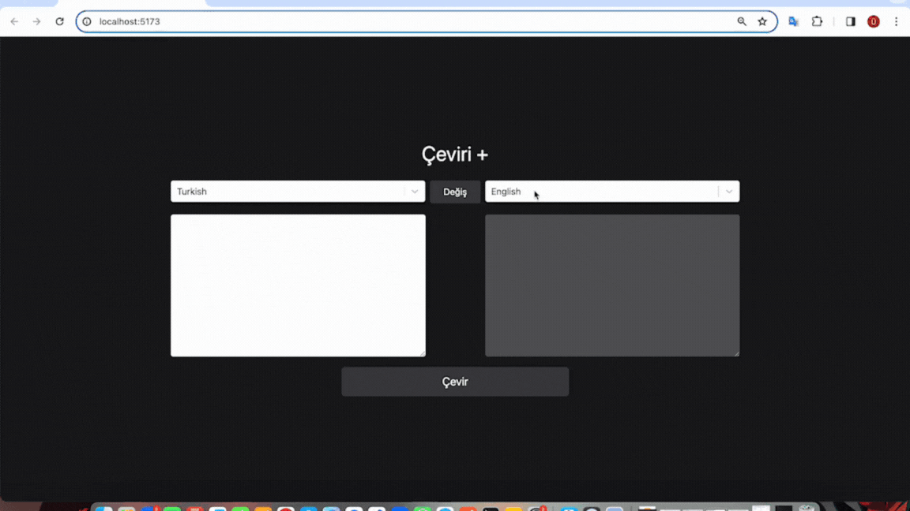

<h1>Redux Toolkit Translation App</h1>

Bu proje redux thunk kullanarak oluşturulmuş bir Çeviri projesidir.

Kullanılan özellikler;

- Axios İstekleri

- React-Redux

- Redux-Toolkit

- React-Select

- Tailwind

Projenin bize sunduğu özellikler;

- 100 tane dilde çeviri

- Diller arası geçiş kolaylığı

- Çeviri bilgilerinin tersine döndürülmesi

- Veri beklerken Loader ile görsellik oluşturma

- Responsive tasarım

<h2>Kullanılan Diller</h2>

Bu projede React, Redux Redux-Toolkit kullanılmıştır

<h2>Ekran Videosu</h2>

